# Git Prompt Cheatsheet

 

## Identifying when you are inside a repo

##### This is **NOT** a `git` repo

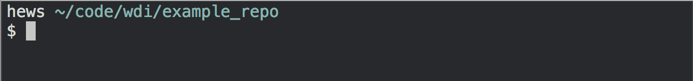

##### This **IS** a `git` repo!

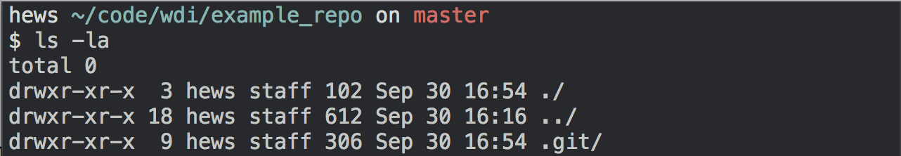

> **It says `on <branch>`, which is `master` by default!**
> 
> You can also tell by typing `ls -la`/`ll`, and check if there is a
> `.git` folder.   However, this only works *in the base of the repo*!

 

## Information about your repo

##### The name of your current branch...

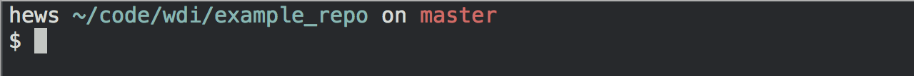

> ... is `master`, in this example. It is `master` by default. 
> It could be something different, like `alternate_working`:

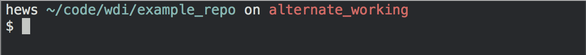

##### The state of the files...

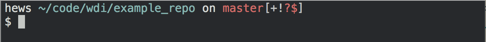

> Between the brackets `[]` there are a few different symbols that express  
> the state of the repo. It's a quick way to keep track of what you'd see  
> when using `git status`.

 

## Tracking the state of the repo: `[+!?$]`

#### `[?]`: There is a new (untracked) file that has been *created*

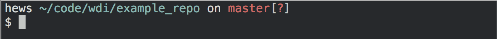

> You can see exactly how the **`[?]`** appears, here:

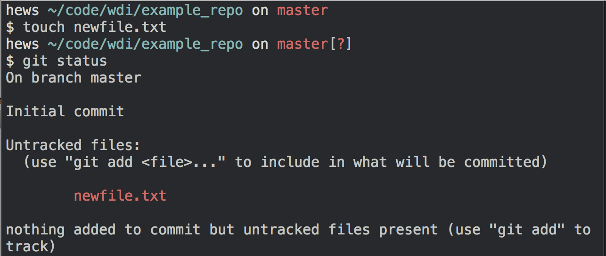

---

#### `[!]`: There is a tracked file that has been *changed*

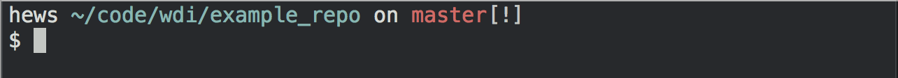

> You can see exactly how the **`[!]`** appears, here:

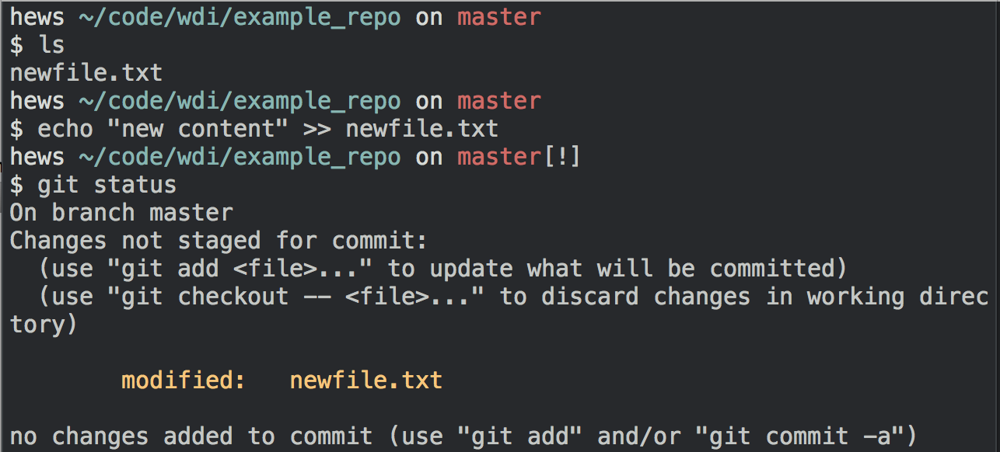

---

#### `[+]`: There are changes that are *staged* (or "added")

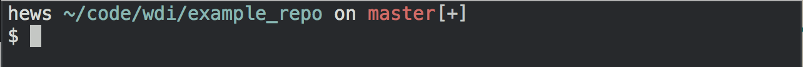

> You can see exactly how the **`[+]`** appears, here:

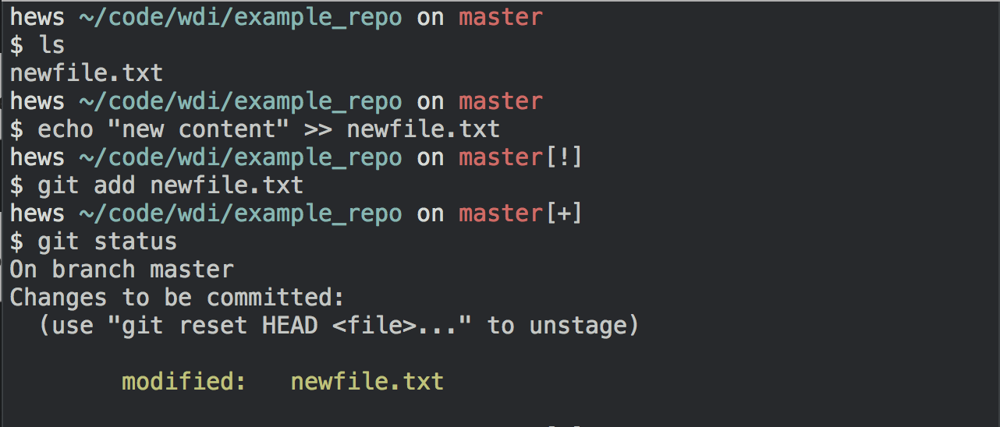

---

#### `[$]`: There is something in your [stash][git-stash]!

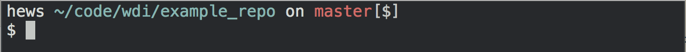

> You can see exactly how the **`[$]`** appears, here:

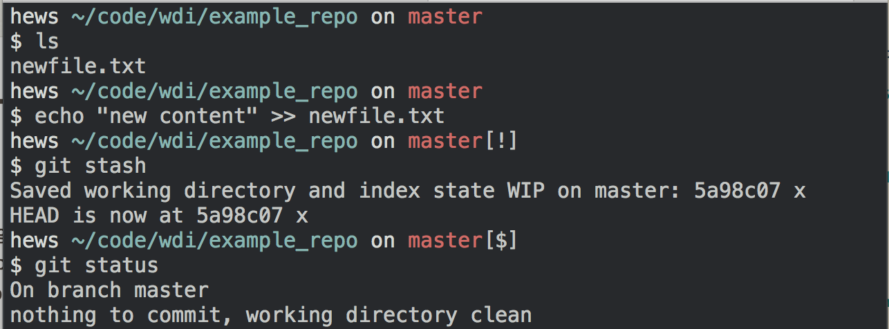

[git-stash]: https://git-scm.com/book/en/v1/Git-Tools-Stashing

