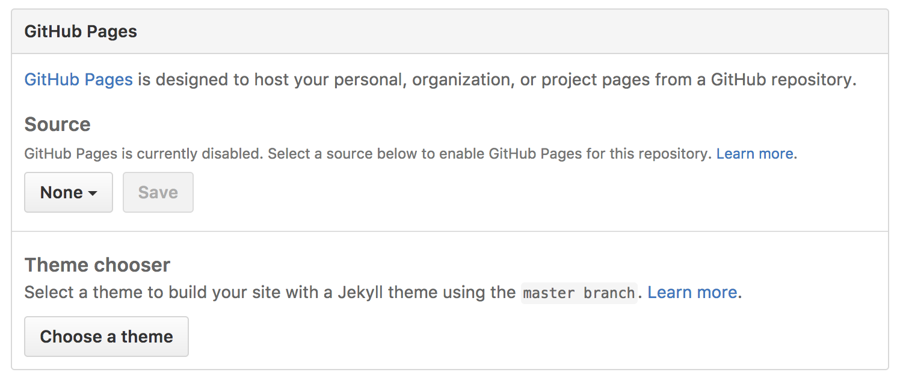
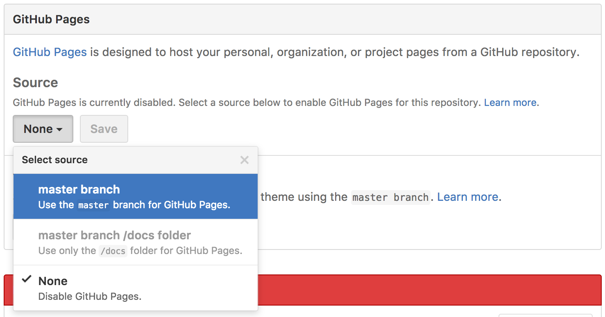
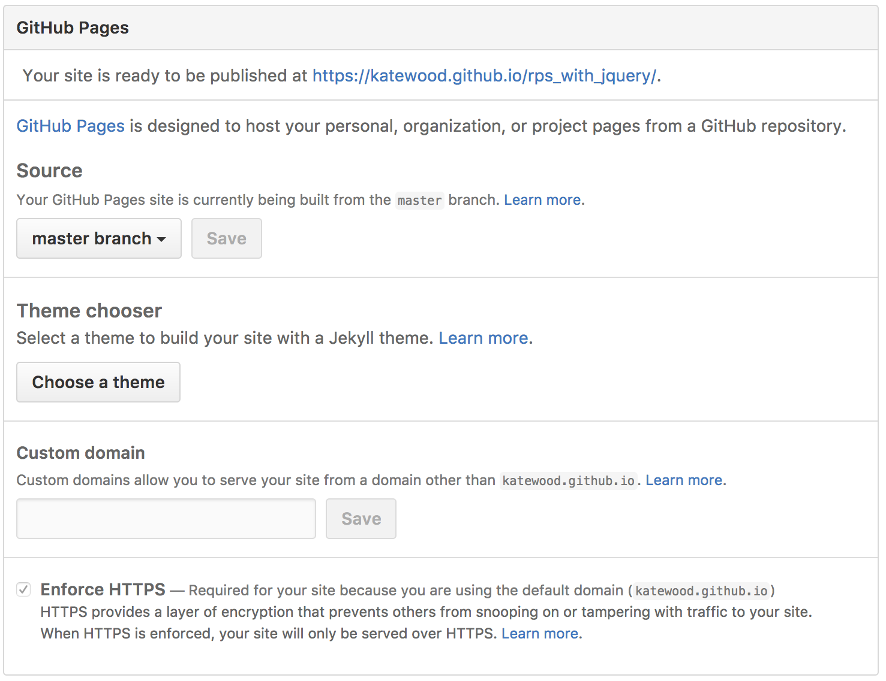
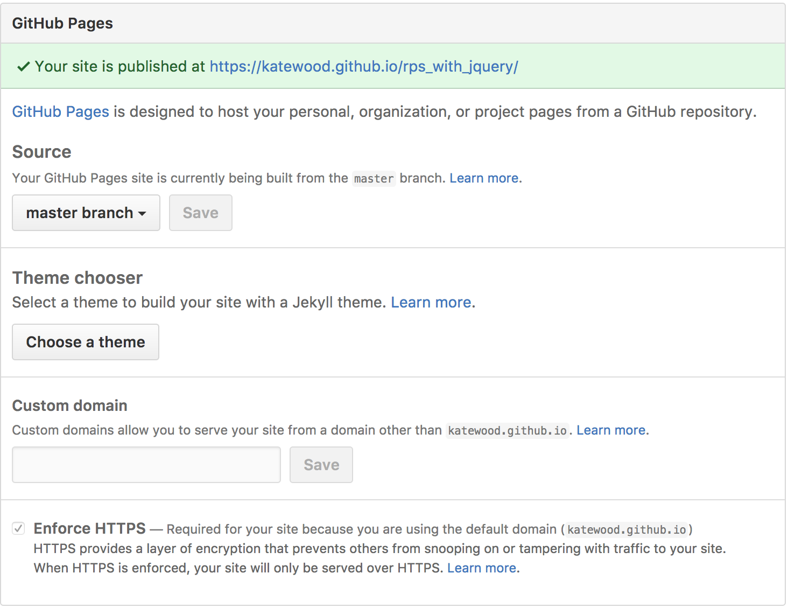

# GitHub Pages Deployment

Deploying to GitHub pages is easier than ever before!

There are only a few steps:

- Create a repo and push all of your code to GitHub
- On GitHub, click on Settings and scroll down to the GitHub Pages section:
  
- Select which branch to deploy (master branch is a good choice!):
  
- Click save. You will see a message that your page is being built:
  
- After a minute or two, refresh the page. You should see something like this:
  
- Now just click on the link and check it out!