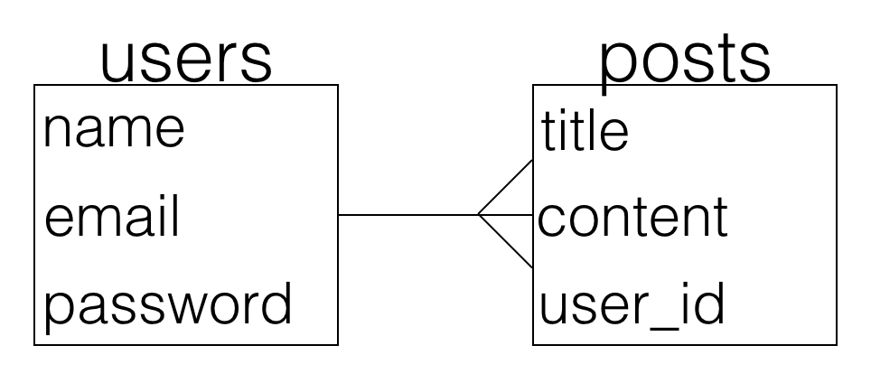
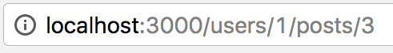

# Nested Resources

For one-to-many relationships, you might want to nest resources.

Example ERD:



In the above data model, each post belongs to a user. Can a post exist without a user? No. So this is the perfect relationship for nested resources.

### URL

In the URL, a nested resource looks like this:



This is the show route for the post with ID 3, which belongs to the user with ID 1. The route for this URL is written like this:

```ruby
get '/users/:user_id/posts/:id' => 'posts#show'
```

Why isn't it `'/users/:id/posts/:id'`? Because a symbol in a route corresponds to a key in the params hash. You can't have two identical keys in one hash!

In the posts controller, you can access the user id and the post id using the `params` hash:

```ruby
params[:user_id] 	#=> 1
params[:id]			#=> 3
```

### Routes

Writing routes by hand is great practice, but nested routes can get long. The easiest way to create nested routes is like this:

```ruby
resources :users do
  resources :posts
end
```
If you `rake routes`, you can see all of the routes created:


Notice that the prefixes for all of the `posts` routes also include the word `user`. This is important to remember when adding links on your pages.

For example, if you want to have a link on your posts index to send you to the new post form, this will **not** work:

```ruby
<%= link_to 'New Post', new_post_path %>
```

It needs to look like this instead:

```ruby
<%= link_to 'New Post', new_user_post_path %>
```

### Further Reading

If you want to use nested routes in your project, be sure to check out the [Rails Guides](http://guides.rubyonrails.org/routing.html#nested-resources).
