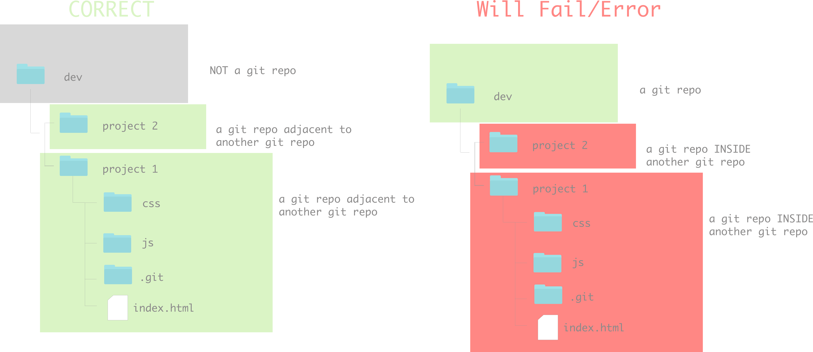
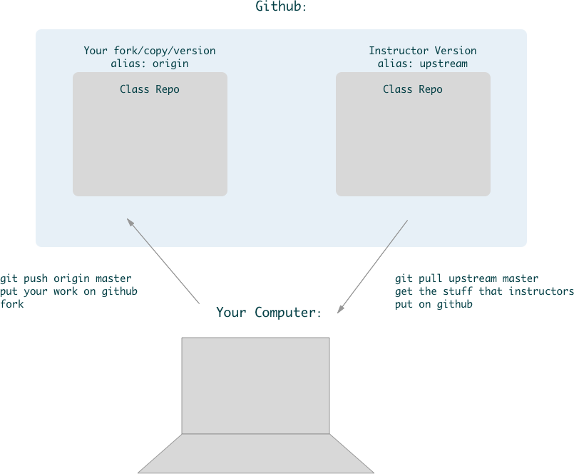

# Git & Github

## Lesson Objectives
1. What is Git?
1. What is Github?
1. How do they work together?
1. Set up SSL
1. How do you make a repository and clone it?
1. Stage files
1. Commit files
1. Push files
1. Pull changes from remote repo
1. Fork a repo
1. Create a github issue
1. Unmake a git repository
1. An introduction beyond the basics (branching merging), adding an SSH key, customizing your terminal to show your git branch
1. History an comparison of versioning tools

## What is git?

A version control system - a way to track changes in your computer.

Git does this for you "behind the scenes"!

## What is Github?

Github is a company that offers storage for your files. It offers a way for people to easily share their files through forking & cloning. In addition, collaboration is made possible by allowing multiple people to become collaborators on repositories.

## Who Uses It?

Companies who share their code: https://octoverse.github.com/

- Nasa:
  - https://www.nasa.gov/mission_pages/apollo/missions/apollo11.html
  - https://github.com/chrislgarry/Apollo-11
- Spotify:
  - https://github.com/zmb3/spotify
- YOU!

## Other Versioning Tools

You can read more information on this history of [file sharing from Wikipedia](https://en.wikipedia.org/wiki/File_sharing)
In the days of old, people used [FTP](https://en.wikipedia.org/wiki/File_Transfer_Protocol), [CSV](https://en.wikipedia.org/wiki/Comma-separated_values),and [SVN](https://en.wikipedia.org/wiki/Apache_Subversion).

Another popular cloud solution that is used with git, Github's competitor, is [Bitbucket](https://bitbucket.org/).

## How Do Git and Github Interact?

### Git

You work with **git** for your local tracking.

### Github

Github is a company that will store your documents "in the cloud". You can have access to your code from any machine from their company website: www.github.com or their enterprise site: https://enterprise.github.com.

**Github:** the code that you write here is public and it can be seen by all! You used this for Fundamentals and will be using it for your projects during the course.

**Github Enterprise:** this is a way for companies to own the server that their work is on save some money. The code here is private. You will be using this for your daily classwork.

### Your Part in Their Relationship

You play the most important part in this relationship. You have to tell **git** whether to track files. In addition, you can also tell **git** to send your work to **Github**.

You do all of this with **git** commands on your command line / terminal.

# Setup

For each repo, we'll follow a bunch of steps to get set up. Setup is typically fast!

## Common Git Commands

Git has some funny phrasing.

- When you want to get code onto your computer you `pull`*
- When you want to send code to github (or elsewhere on the internet) you `push`
- If you want to make a copy of a repository on your computer(also known as local/locally) it's called `cloning`
- If you want to make a copy of a repository on github and store it on your account, that's called `forking` - note: `forking` is specific to github and is *NOT* a git command

 \* `pull` can also mean a request for someone to pull in your code - on github you may see something called `pull requests`

When you use bash you are talking to your computer. There is a  structure to the commands you tell it.  

A git command has a minimum of 1 argument.

Git commands are always executed by first typing `git`

The first argument is the command (or verb), like
- `git init` (initialize a new git repository)
- `git push` (send the code to a remote location)

The second(+) argument gives the first argument context (when needed)
- `git add .` (add all files in this directory)
- `git pull origin master` (get all files from the url that has an alias of `origin`, from the branch `master`)

Lastly, flags can be added
- `git remote -v` (git show remote(s) and be verbose(give more detail))

Here is a table of our commonly used git commands:

| git | Argument | Flag(s)/Additional arguments | Description |
|:---:|:-----------:|:-------:|:-----------:|
| git | init |  |  Initializes a new repository|
| git | add | `.` or filename | Takes untracked files and adds them to the staging area so that they can be committed   |
| git | commit | -m 'some message'  |  Takes a snapshot of files in the staging area/ saves this version of them as a commit|
| git | remote | -v |  Shows the remote repositories associated with the local repository. Most repositories have an alias for their urls like `origin` or `upstream`|
| git | pull | upstream master |  Gets files from a url with an alias of `upstream` from its branch `master`|
| git | push | origin dev |  Sends files to a url with an alias of `origin` to its branch `dev`|
| git | log| --oneline |  Shows a log of commits of a repo (--oneline shows a truncated message)_`q` to exit_|
| git | status |  |  Shows the state of files in a repo (untracked, modified, staged)|

[Link to our wiki with a more complete list of git commands](https://git.generalassemb.ly/Software-Engineering-Immersive-Remote/SEIR-MAE/wiki/Git-Cheatsheet)

Note: `fork` is not on this list because `fork` is not a git command; it is github-specific for copying a repository on github to a new location on github.

### Git VCS - Branches and Merging
Git is a VCS (Version Control System). There are a few popular ones, but git ends up being a top choice because of its branching and merging feature.

If we think back to our past projects(or term papers), when we wanted to implement some major changes to our code/text and failed our popular options were to
- `⌘Z` throughout our files and hope for the best
- Seriously contemplate coding out our project from scratch again

[Git's about page has 4 great reasons why it works so well for individuals and large teams.](https://git-scm.com/about)

- Frictionless Context Switching - Switch between branches, whenever! No worries!
- Role-Based Codelines - Have many versions of your code - Production, Development, Day-to-Day etc.
- Feature Based Workflow - Create a new branch for each feature
- Disposable Experimentation - if a branch doesn't work out, you can just walk away or toss it. It has no impact on the working code

You may be thinking 'this sounds too good to be true!' It's not! But there is a catch! Git requires changing the way we are used to working on projects. Which means it takes some time and practice to learn to use git.

## SSL Key
- When you use `https` to connect to github, it will likely ask for your password often.

- If you get tired of always entering your github password, you can use the ssh URL (as opposed to the https URL) when cloning a repo

- You'll need to also add what's called an ssh key to github https://help.github.com/articles/generating-an-ssh-key/
- Now you can use the ssh url when cloning instead of https

Both will give you all the rest of the same features. It's just a matter if you'd like to spend more time setting up first or if you don't mind entering your password more often.

## Practice Making a Github Repo

### 2 Ways :octocat:

For both ways, let's make a folder on our `Desktop` called `github_practice`

`cd` into that folder in terminal

#### 1. Making a repo on Github first and cloning it locally

1. Go to your (regular, not enterprise) Github account and log in to your account.

1. Click on the plus sign next to your profile photo at the top-right corner of your page:

    

1. Click on `New repository`

    

1. Create a new repo by entering a name in the `Repository Name` field. Note that this name has to be *unique* to your repository. Let's use the random name that they suggested for me: `repo-practice`

    

1. This will be a **public** repo. Private repos required a paid account.

1. Click on the "Initialize this repository with a README". A README file is just a blank document that is the default page that your repository displays. It is a markdown file and normally includes information that you provide about your application.

    

1. Click `Create repository`. You should be redirected to the newly made repo.

1. Click on the `Clone or download` button.

1. Copy the link (this is the direct link that is created by Github to your repo).

    

1. Open your terminal / Git Bash - it's time to make a local copy of this Github repo!

1. In your terminal / Git Bash, navigate to the folder where you would like to keep the folder for this repo. Let's use that `github_practice` folder we created on our desktop

1. `cd` into `github_practice` DO NOT create a new folder for our repo, when we use `git clone` it will create a new folder for us

1. Type the git command `git clone` followed by the link to your repo.

    

1. That's it! Type `ls` to see your folder's contents. Your new repo should be there. Navigate inside the folder, type `ls` and confirm that you have a `README.md` file.

1. Go ahead and open the `README.md` in your text editor (Bonus! Do it from the command line!). You can write plain text in a markdown file. So you can send yourself a message! If you don't know what to write, go with a classic `Hello World!` , save this file.

1. In terminal type `git status`

1. `git add .` to add your file to be `staged` - this will tell git that you'd like to track this file's changes

**Note:** `git add .` adds everything in the current directory, including directories inside this directory. It's like a waterfall. It will never add files above where you are in terminal.
cd.
1. `git commit -m 'my first commit'` - this will take a 'snapshot of your file' and have a message attatched to it

1. `git push origin master` - this should send your changes to your github repo

1. Go back to the browser, refresh, you should see your updated readme!

1. Back in terminal type `git status` - it should now say there is nothing to commit

1. We can remind ourselves where we sent our work, type `git remote -v`

This will show you the name of the remote, by default it is called `origin`. Rather than typing `https://github.com/stuff/morestuff/blahblablah` every single time you want to connect with your repo, you just type `origin` instead - less typing = working smarter, not harder!

You'll also see the branch name, by default `master`, you can have many branches and their utility is amazing! In fact it is the branching of git that makes it a top choice. But for today, we'll just work with our master branch.

#### 2. Making a local folder, turning it into a git repo, pushing it up to Github

1. Navigate to the folder where you're keeping the files for this lesson. Likely, you just need to `cd ..` back to the `github_practice` folder's root.

GOTCHA: Do not initialize a git repository inside of another git repository, do not make your root directory of your computer a git repository - this will confuse git and you won't be able to track or even open your files on github. Additionally, making  your entire computer a git repository can siginficantly slow down your entire computer.

1. Create a new folder called `another_project` inside `github_practice` - make sure you are NOT inside the git repo you created

1. Navigate inside `another_proejct` and type `git status` (you should get an error). We need to ask git to track this folder, so let's tell it to do so.

1. Inside this folder, run the command `git init` (this tells git to track this folder). Type `git status` to see that there is no longer an error.

1. `touch README.md`

1. `code README.md` and type some text and save the file

1. in terminal, `git add README.md`, `git commit -m 'first commit'`

1. We now have a local git repo, we have to create a repo on Github and connect it. Navigate to Github and log in if you're not logged in already.

1. Create a new Github repo. Let's give it the name `another_project` (note that this is the same as our local file, but it does not have to be for it to work).

1. **Do not** initialize a README (we already made it on our own in our local repo).

1. a new page in github will appear with instructions. We'll follow them. Note - with bash commands you have to enter them one at a time.

1. Grab the first line and paste it in terminal it will be something like: `git remote add origin git@github.com:username/new_repo`

1. Confirm that you have the remote created by running the command `git remote -v`, you should see the URL you added. If you see nothing, then something went wrong.

1. Grab the second bash command from github, it should be something like `git push -u origin master`

1. Go back to Github and refresh your page. Your README file should now be pushed up from your local repo to your Github repo.

## Interacting with Other People's Repos

Sometimes we want to interact with another user's repo. We can safely do this by **forking** it.

**Forking** is the equivalent of making a copy to keep for ourselves.

 

## Let's Practice Together and Get Our Own Copy of the Class Repo

### Part 1 - Explain Forking

The instructors will have a master copy of the class repo. Only the instructional team can modify this repo.

You'll get the updates and changes we make by doing `git pull upstream master`

You'll do lab work, morning exercises, and get homework starter code in your local (on your computer) copy.

Visually:

### Part 2 - Fork It

1. Navigate to: https://git.generalassemb.ly/Software-Engineering-Immersive-Remote/SEIR-MAE

1. Fork this repo and add it to your personal (GHE - github enterprise) repo by pressing the fork button on the upper right side.

    

1. On Github, select yourself:

    

1. On Github, if it hasn't already taken you to your copy, navigate to your forked version of this repo (your username should be in the top left corner of the page followed by a slash and the name of the repo. Ex: `harrypotter/WDIR-Awesome`).

#### Fork (your copy):

#### Original (instructor copy):

## Get the Class Repo locally

### Step 2 - Clone It

1. Click on the `clone or download` button on YOUR Class fork:

    

1. Copy the web address (use the clipboard button)

1. Open your git bash (terminal / Git Bash).

1. Navigate to the folder where you would keep your work

    Top Options:
     - in your root directory make a folder `dev` and keep all your coding work in there, including the class repo
     - from your root directory, `cd Desktop` and have a copy of the class directory there

1. Make a clone using terminal

  

NOTE: This will create a folder named the same as the repo. It should contain all of the files and folders that were located in the repo.

## Step 3 - It's Local!

1. Check it out! Type `ls` to see the files that you cloned from Github. These files are now **local**.

1. `cd` into your cloned repo

1. Type `git remote -v` to confirm that git has created a remote link for you. The default name is `origin` and to confirm that you're inside the right file, check the name of the repo in the remote link.

Expected:

1. Add the instructor repo so  you can get our changes/updates. Navigate to the instructor copy. You can click the link below your fork that says where your fork came from

1. copy the url using the `clown or download` button and then the clipboard button

1. go back to terminal and type `git remote add upstream` + paste the link you copied

1. check that you have added your remotes correctly:

You should see a total of 4 lines:

Again, origin should be associated with YOUR copy. YOUR username should be part of this URL

And, upstream should be associated with the instructor copy. There should be `Web-Development-Immersive-Remote` as part of the URL

## Step 4 - Edit Locally

1. Navigate inside the repo. `cd` to this unit `cd unit_1` then `cd` today's day (e.g. w01d03), then `cd` into `student_examples`

1. Inside `student_examples` touch `example.js`

1. Open this with your text editor

1. Type `console.log('Hello Github!')` and save it

## Almost done! We'll talk about Step 5 together

## Step 5 - Push Local Changes to Github

2. In your terminal / Git Bash, run the command `git status` to see that there is a file that has changes that need to be added and committed.

3. In your terminal, run the command `git add .` to add all of the files that need to be tracked.

    

4. In your terminal / Git Bash, run the command `git commit -m" add a message here about what you did"` to commit the files.

    

5. In your terminal / Git Bash, run the command `git push origin master` to push your work from your local machine to your repository on Github.

   

   NOTE: `origin` here refers to the default variable name that git has assigned to your repository. `master` refers to the default branch that Github creates for you when you make a new repository.

6. Go to Github, look at your forked repo, refresh the page. Your changes should now appear in the file.

Oh wait... let's change something...

## Step 6 - Make Another Change

1. In your text editor, open the `example.js` file and change the string again!

2. In your terminal / Git Bash, run `git status` to see that there is a change that has been tracked.

3. Go through the process of adding, committing, and pushing your code.

4. Go back to Github and look at the pull request that you submitted. It should have our newly updated code!

5. You can change and push your code as many times as you'd like. In fact commiting your code often is highly recommended

## Almost done! We'll talk about Step 7 together

## Step 7 - Get Changes From Original Repo
Sometimes you want to get changes that have been made to the original repository.

I am going to make a change in today's `instructor_examples` folder. Then you'll pull the changes down to your local copy.

now run `git pull upstream master`

git is going to display some messages, these are normal:

What it looks like in your terminal

 

  or

 

 

## Unmake a git repository
What makes a git repository a git repository?

The hidden file `.git`

You can check if you are in a git repo by typing `git status`

You are NOT in a git repo if you get this message:

You ARE in a git repo if you get a different message. Here is one sample one

If you are in the root of your git repository you can type `ls -a` to show your hidden files and you'll see a folder `.git`

You should NEVER edit inside this folder. Git is very sophisticated and the contents of this folder are automatically generated. Don't mess with the git magic or you may destroy your whole git repo.

With that in mind, what if you accidentally made something a git repo? Or you no longer want to have something as a git repo? You can `rm -r .git` to return your directory back into a normal repository.

## See Which Branch You're On
Some people like seeing what branch their on/if they are in a git repository by having a message in the terminal prompt. In this case the master branch is listed in green:

If you too would like to have this. Go to this [github gist](https://gist.github.com/joseluisq/1e96c54fa4e1e5647940) and follow the instructions.

## A Brief History of Versioning tools

###  Explain the difference between git and other versioning tools

- In the old days, people would use FTP (File Transfer Protocol) to send their files to central computer
	- The issue:
		1. Two people (Person A, Person B) copy the same file from the remote repo at roughly the same time
		1. They both make changes
		1. Person A uploads their changes
		1. Person B uploads their changes, overwriting Person A's changes
- The next step was to create a locking mechanism
	- How it worked
		1. Person A would "check out" a file (like in a library)
		1. Person B would not be able to check out that file until it was checked back in
		1. Person A would make changes to the file and then check it back in
		1. Person B could now check out that file
	- The issue
		- Person B would have to wait for person A to finish with a file to start work on it
- The next step was tools like CVS and SVN
	- How it worked
		1. Both Person A and Person B could check out a file at the same time
		1. Person A modifies the file and checks it back in
		1. Person B modifies the file, tries to check it back in, but cannot
		1. Person B must re-check out the file that now includes the changes made by person A
		1. CVS/SVN will attempt to merge the changes together
		1. As long as the changes made by both Person A and Person B are on different lines, this will succeed
		1. Once the changes made by Person A have been merged with Person B's version of the file, Person B can now check in their file
	- The issue
		- If a person is not ready to check in a file, there is no way to keep track of the changes made to that file
		- If something goes wrong before checking the file back in, the user must, figure out what happened, go through an almost endless number of Undo commands in their text editor, or revert their file to version that is in the repository.  A lot of work could be lost
- Git functions just like CVS and SVN, but it adds a local repository
	- This allows a user to keep a log of their local changes before finally pushing everything back to the remote repository
	- The user can also travel "back in time" to previous states that have been saved locally, but not yet pushed to the remote repository.  This is great for when something goes wrong
	- The process:
		1. Add files whose changes you want to be logged
		1. Log the changes of the files that were added (called making a "commit")
		1. Once all commits have been made, and you're ready to send your changes to the remote repo
			1. "pull" any changes that have been made to the repo since you last synced your local repo with the remote repo
			1. "push" your changes to the remote repo.

## Practice on Your Own

Learning git is hard! It's a pretty different way of tracking and moving files than we're used to. But practice will make it come naturally. We'll be using git and github every day so you'll get comfortable with it quite quickly!

We have a [walkthrough](https://git.generalassemb.ly/Software-Engineering-Immersive-Remote/SEIR-MAE/wiki/Homework-Submission) on how to submit homework in our repo.

# Homework submission

You will create one new Github Repository for class that will be where you will host each homework assignment. You will only ever need to create ONE repository (we will do this together right now) and then going forward you will submit homework to this repository as a new neatly labeled folder.

We will walk through this together right now!

### The steps below will be repeated every week for each homework assignment
* Using that week's homework folder on your forked version of Github, push your changes to your repository from your terminal by changing into your repository from your terminal and running the following commands:
* `git add .`
* `git commit -m "current week homework”`
* `git push origin master`
* Fill out this [Google Form](https://docs.google.com/forms/d/e/1FAIpQLSfUPnan89JtgRPEbK7GK2yXfUG18y5zzq3szuiXsQ6Md_Julw/viewform) with your github link for that specific homework. It will be the same Google Form for each homework.
