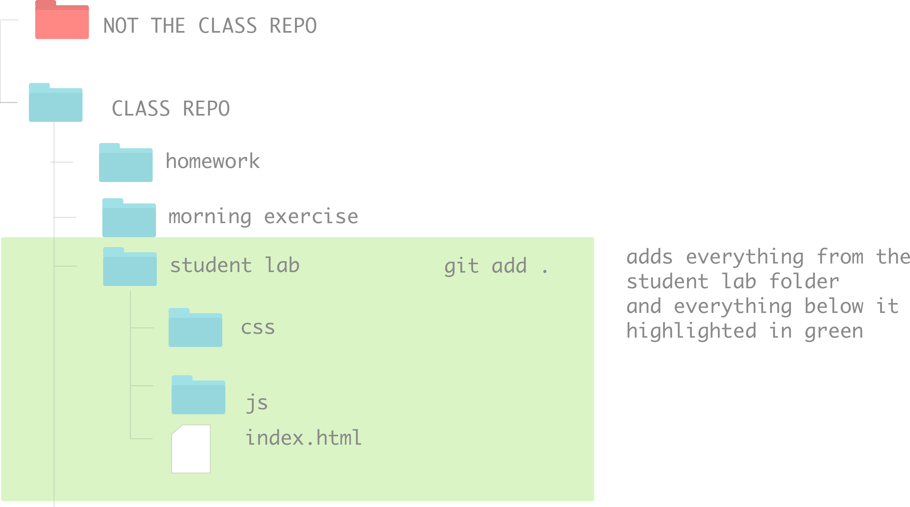

---
Title: Review: git/github, terminal, and anything we've covered so far & HTML Boilerplate <br>
Type: Exercise<br>
Duration: "0:45"<br>
Modified by: Kristyn Bryan<br>
Creator: Karolin Rafalski<br>
Competencies: git/github, terminal, html fundamentals <br>
Prerequisites: [Introduction to HTML](https://www.youtube.com/watch?v=DxhXFpsN5I4&index=1&list=PLdnONIhPScST0Vy4LrIZiYKpFNoxgyH7J)<br>

---

# Git/Github Review - Confirm Success with Submitting HW


Let's take some time to make sure we all submitted hw correctly and we are able to get the course materials for the day.


### Each of you will interact with three copies of the class repo:
1. The instructor version
    - accessible to you on github. The github version is known as the 'remote' version or 'on/in the cloud' or 'on the internet'
      - you can look at the repo in the browser by going to the url: `https://git.generalassemb.ly/software-Engineering-Immersive-Remote/SEIR-MAE/`
      - you can get the contents onto your computer (local version) by `git pull upstream master` (we set this up yesterday). Make sure you push your changes to your remote fork before pulling from the `upstream master`
        - `pull` means bring the changes 'here'
        - `upstream` is just an alias (another name) for the url location of our repo. Computer programers love to work smarter and not harder. By renaming the url to something short, informative and memorable it is much easier to type `upstream` than having to type `https://git.generalassemb.ly/software-Engineering-Immersive-Remote/SEIR-MAE/` every single time you want to get the changes
        - `master` is the name of the branch. `master` is the default name of the first branch created. We will learn about branches later. For now, we'll only work with master
2. Your remote version
    - accessible to you on github by going to the url
    - you can look at the repo in the browser on github
    - you can get contents onto your computer (local version) by `git pull origin master` (we set this up yesterday)
3. Your local version
    - accessible to you from your computer. This is the copy that 'lives' on your hard drive.
    - it does NOT automatically sync. You have to tell it to sync with the remote versions. This is a good thing.
    - you can send your version to your fork on github (origin). But the instructors have set it so that you can't send your work to our copy (upstream). If you try, you'll get an error. This is nice! You won't accidentally break the class repo.

- Homework submission will be a link to YOUR url of your copy of the class repo homework location


###  Daily workflow:

- `git status` - see the current state of your files
- `git add .` or `git add -A` (they both do the same thing) - select the files you want to track/save to github (called `staging`)
    - you may not always want to add all of your files all the time.
    - the command `git add .` or `git add -A` specifies 'all the files and folders in this directory' - so anything at this level and below. It will not select files that are in a higher directory
    - if you want to get files that are elsewhere, the easiest thing to do is to navigate to that place and use the above command



- `git commit -m 'some informative message'` - this is the command to make a `snapshot` of your file (saves the current version)

- `git push origin master` - this sends your work to your remote copy of the class repo

- `git pull upstream master` - get the latest instructor stuff

### Homework submission: 
  * Use the days homework folder for your submission.
  * Push your changes to your repository from your terminal by changing into your repository from your terminal and running the following commands:
  ```
  git add .
  git commit -m "current week homework”
  git push origin master
  ```
  * Fill out this [Google Form](https://docs.google.com/forms/d/e/1FAIpQLSfUPnan89JtgRPEbK7GK2yXfUG18y5zzq3szuiXsQ6Md_Julw/viewform) with your github link for that specific homework. It will be the same Google Form for each homework.


### What Success Looks like

-  `git status`


- `git pull upstream master`


### Common Errors and how to solve them


---
**Command:**
- `git status`

 **Error:**
 - `fatal: Not a git repository (or any of the parent directories) `

 **What does it mean?**

 - You are not in the correct directory in terminal

 **Fix**

 - navigate to the correct location on Terminal

 ---

 **Command:**
 - `git push origin master`

  **Error:**
  ```![rejected  master -> master (fetch first)]
  error: failed to push some refs to 'https://github.com/...'
  ...
   ```

   **What does it mean?**

   - Your remote version has more recent updates. You must pull them and merge them before you can push your latest changes
   - Important: Terminal may open Vim - remember to quit Vim - you must type `:wq` - the reason it opens Vim is so you can have a chance to write a descriptive comment about the merge. Keep it simple! In this class, you don't have to worry about writing a note about the merge.
   - Important: failing to exit Vim correctly can cause errors and you will have to start typing the commands again to finish

   **Fix**

   - `git pull origin master`
   - `:wq` if you are in Vim

---

  **Command:**
  - `git status`

   **Error:**


```
   On branch master
   Your branch is up-to-date with 'origin/master'.
   Untracked files:
      list_of_files
    Nothing added to commit but untracked files present (use "git add" to track)

```

   **What does it mean?**

   - Your files are not being tracked

   **Fix**

   - `git add .` or `git add -A`

---

### Converting a git repository back to a regular directory

- When you run `git init` it creates a hidden directory called `.git`
- You can only see this folder when you run `ls -a` , you won't see it if you just run `ls`, additionally, Finder's default is to not show hidden files
- `.git` is updated automatically and you should never make changes in there
- if you no longer want a directory to be tracked by git, you can delete the entire `.git` folder, then when you type `git status` it should then say `fatal: Not a git repository (or any of the parent directories) `

**DANGER ZONE** to remove `.git` , go into the directory where the wrong `.git` is and type `rm -rf .git`

**Use extreme caution** `rm -rf` is a very dangerous command that can irreversibly delete anything on your computer, so make sure to specify the exact directory you want to delete


### One More Gotcha!

GOTCHA: Do not initialize a git repository inside of another git repository, do not make your root directory of your computer a git repository - this will confuse git and you won't be able to track or even open your files on github. Additionally, making  your entire computer a git repository can siginficantly slow down your entire computer.


#### Ask Yourself:
1) How many repos can you have on github?
2) How many repos can you have on your computer?
3) Can you put a git repo inside another repo?
4) Should you make your whole computer a git repo?

## Part 2
#### Any Questions About Submitting Homework?

If you had any questions about how to submit your homework, ask! We're here to help clarify.


## Part 3
#### Actvity: More about HTML Documents

### Objectives:
- UTF-8
- HTML Boilerplate
- Linking files in HTML via relative and absolute pathing (http/https only)

### Watch These Videos

 - [HTML Video 1]( https://www.youtube.com/watch?v=DxhXFpsN5I4&index=1&list=PLdnONIhPScST0Vy4LrIZiYKpFNoxgyH7J)  ~ 14 minutes
 - [UTF-8 : The Unicode Miracle](https://www.youtube.com/watch?v=MijmeoH9LT4) ~ 9.5 minutes
 - [Why HTML seems to tolerate mistakes](https://www.youtube.com/watch?v=-csXdj4WVwA) ~ 10 minutes

### About HTML Boilerplates
Boilerplate is defined as a standard template of any kind that can be used without much modification.

**Lesson Objective**

Rather than trying to memorize the boilerplate, build one on your own and take the time to understand each component's function.

- HTML documents have some standard elements that are always included:

  - `<!DOCTYPE html>`
  *Put this tag at the top of the document, to declare that this is an HTML5 document*

  **Additional boilerplate tags include**

  - `<html>`<br>
  - `<head>`<br>
  - `<body>`<br>
  - `<meta charset="utf-8">`<br>
  - `<title>`<br>

#### Ask Yourself:
1) What is the function of the `<head>` and `<body>` tags?
2) What kind of tags go inside each one?
3) Where does the `<title>` tag go (`<head>` or `<body>`)?
4) Where on the web page does the text inside the `<title>` tag appear?

Other things to think about:
5) What does `<meta charset="utf-8">` do? (hint see above video)
6) According to the above video about HTML, what could you guess would happen if you forgot the `<html>` tags?


### Make a Boilerplate

There are usually a few common elements that are included in most HTML sites, including folders (for organization), CSS files and JavaScript files. Let's add them, so you can have a boilerplate ready to go whenever you start a new homework or project.

<details><summary>File Structure</summary>

What it looks like in your terminal:


<br>

What it looks like in your browser (GUI):


</details>

#### Create files and folders
Note: I have a `boilerplate` folder already created within this morning's `morning_exercise` directory with the files and folders that you will need. Feel free to reference this.

Inside today's Morning Exercise folder:
1) Make a new folder (`mkdir`) called `project-boilerplate`
2) Navigate into the folder `cd project-boilerplate`

#### Make an HTML file

1) touch `index.html`

#### Make a JavaScript file
1) touch `app.js`
2) open `app.js` to edit the file in VS Code `code app.js`
3) make a `console.log` in the JS file so that you can verify that it is hooked up. So, on line 1 of your `app.js` file, write the code `console.log("My app.js file is attached")`.

Note: if you have more than one JavaScript file, it would be typical to put those files all in a folder called `js` (or a similar name  - see example with CSS)

#### Make CSS folder and file
- Create a  new folder for your css `mkdir css`
- Navigate inside the `css` folder and create a file called `style.css`
- Use VSCode to edit your `style.css` file.
- Select the `body` and give it a `background-color` [of any color of your choosing](http://htmlcolorcodes.com/)
- Take a moment to think about how you can tell if you have successfully linked your stylesheet.

<hr>

#### Connect Your Files
1) Open your `index.html` in vscode (`code index.html`)
2) Write your HTML code (see above and refrence the videos). HINT: VSCode has a built-in way to create an HTML boilerplate! On line 1 of your `index.html` file, type `HTML` and hit `tab`. Note: make sure that you do not put a space after `HTML`.
3) If you automatically made the tags, they should be tabbed and nested appropriately. If you wrote it from scratch, make sure to nest the tags to show the child / parent relationship.
4) Add a link to your `app.js` (where does it go? In the head? in the body?)
  - Check that it works by looking for the `console.log` that you added in the `Console` tab of your Inspector.
5) Add a link to your css (where does it go? In the head? in the body?)
  - Test it to be sure it works (how can you tell?)

#### Add a few more common elements

##### Image tag
1) Find an image on the internet that brings you joy
2) Copy its URL
3) Add an image tag  `` inside the body that will display your image
4) You will need to give the `` tag an `src` attribute and set its value to the image's url.
5) It is good practice to also add an alt attribute to an `</img>` tag. Why? What does this attribute do?

##### Heading Level 1 tag
1) Add an `<h1>` tag to describe the image you have added

###### Anchor tag `<a>`
1) Add an anchor tag `<a>` that links to a `#`. This will not take you anywhere, but gives the illusion of a link.

###### Paragraph & Questions
1) Use a paragraph tag inside your html and write a short answer to the following: Why were `<b>` (bold) and  `<i>` (italics) tags replaced by `<strong>` (strong) and `<em>` (emphasis) tags as the new standard in HTML 5?


## Part 4
###### Watch this video on HTML!

- [HTML 2](https://www.youtube.com/watch?v=KhbnrDhWDdE&index=2&list=PLdnONIhPScST0Vy4LrIZiYKpFNoxgyH7J)
