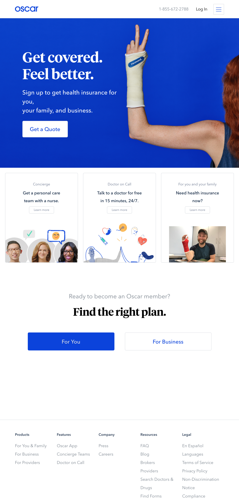

# Oscar Mockup

Your job will be to use Oscar's old website as a mockup and try to recreate it using HTML and CSS 

#### Learning Objectives

- HTML & CSS 
- Positioning 

#### Prerequisites

- HTML & CSS

---

## Getting Started

1. First, watch these CSS videos:

    1. [On the box model](https://www.youtube.com/watch?v=HNgdhp1_kEE&index=6&list=PLdnONIhPScST0Vy4LrIZiYKpFNoxgyH7J)

    2. [On display](https://www.youtube.com/watch?v=qjSe_K3agYc&index=7&list=PLdnONIhPScST0Vy4LrIZiYKpFNoxgyH7J)

    3. [On floats](https://www.youtube.com/watch?v=-4Yy3WNmvmg&list=PLdnONIhPScST0Vy4LrIZiYKpFNoxgyH7J&index=11)

    4. [On responsive design](https://www.youtube.com/watch?v=BsuCBmzLf_U&index=21&list=PLdnONIhPScST0Vy4LrIZiYKpFNoxgyH7J)

    5. [On units of measure](https://www.youtube.com/watch?v=5axuSSBIMuQ&index=9&list=PLdnONIhPScST0Vy4LrIZiYKpFNoxgyH7J)

1. Once you're done watching those, inside this `oscar` folder, create `index.html` and `styles.css` files. Work in those files to mockup the following: 

## Deliverables

`index.html` and `styles.css` files that try to recreate the Oscar mockup as best as you can. A few notes: 

1. The images are in the `images` directory inside this oscar folder, except for the header. For that, just use a solid color background or use whatever image you like.
1. Don't worry about icons like facebook, twitter, youtube, instagram. As a stretch, use the inspector to see what they did and try to copy it.
1. Don't worry about matching the fonts the site uses. Just use `font-family: Arial` or `font-family: Times New Roman` or whatever you like.
1. Don't worry about rounded corners of buttons. If you can figure it out, great!
1. It's fine to guess at the colors
1. **The main thing we want you to focus on is the positioning/layout!**

---

*Copyright 2018, General Assembly Space. Licensed under [CC-BY-NC-SA, 4.0](https://creativecommons.org/licenses/by-nc-sa/4.0/)*
