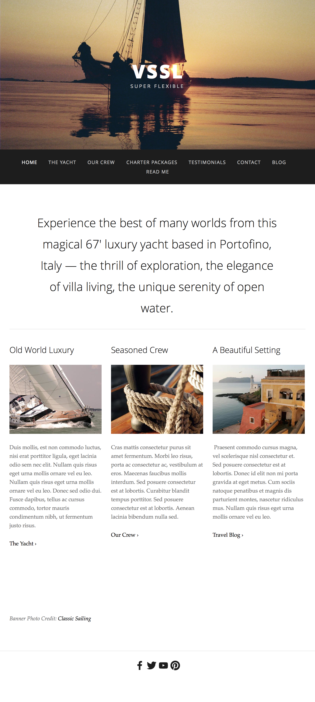

Title: CSS Mockup - VSSL 
Type: Warm Up Exercise  
Duration: "0:45" 
Original creators: WDI-Archer, WDI-Funke, WDI-Panthalassa 
Adapted by: Kristyn Bryan, Cathleen Wright, Jerrica Bobadilla 
Competencies: Basic HTML & CSS blocks 
Prerequisites: CSS, HTML  

During the last morning exercise, we built out the HTML for the VSSL mockup:

Today, we're going to work on styling it with CSS to make it look more like the mockup.

## Setup

1. You already created the HTML for this mockup last morning exercise. You should have created it in your `w04d3/warm_up_exercise/vssl_mockup` folder. We called it `index.html`.
1. Let's copy your work into your student_examples folder for today.
1. In terminal:
    - navigate to your `/w04d3/warm_up_exercise/vssl_mockup` folder
    - from there type `cp ../../../w04d3/warm_up_exercise/vssl_mockup/*.html .`
        - The cp command will copy all html files from last morning exercise's folder into today's warm_up_exercise/vssl_mockup folder
        - _NOTE:_ if you have created your files elsewhere, you will need to adjust the path
        - _NOTE:_ if you created more files than this (like a CSS file), you will also need to copy those files
1. Inside your vssl_mockup folder, create a `style.css` file. Make sure it's on the same level as your `index.html` file as well as the `img` folder and `mockup.png` file.
1. Inside your `index.html` file, link your `style.css`
1. Open `index.html` in your browser.
   - You can check that your CSS is attached correctly by adding a background color to the page temporarily.  

## Activity

1. Your focus should be on positioning the content!
1. Save looking for fonts for last. You don't need the exact font - just choose something that looks similar.

**Take this time to ask questions and review HTML & CSS with your instructors!**
- Once you have completed the mockup, ask an instructor to review your work and provide feedback in your breakout room!

## Resources

If you struggled making the html, we've included an sample_index.html for you to work off of in the vssl_mockup folder.

- [A Complete Guide to Flexbox (CSS Tricks)](https://css-tricks.com/snippets/css/a-guide-to-flexbox/)  
- [Equidistance Spacing- examples of failed attempts and wins](https://css-tricks.com/equidistant-objects-with-css/)
- [Google Fonts](https://fonts.google.com/)
