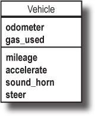

#  Ruby - Classes Part2

| Title | Type | Duration | Author | 
| -- | -- | -- | -- |
| Ruby classes - part2 | Lesson | 2:00 | Suresh Melvin Sigera |

## Objectives
- Instance variables Vs Class variables
- Describe what is inheritance is
- Demonstrate and implement inheritance using Ruby
- How to use super

## What is inheritance?
Instead of repeating method definitions across many similar classes, inheritance lets you move the common methods to a single class. You can then specify that other classes inherit from this class. The class with the common methods is referred to as the superclass, and the classes that inherit those methods are known as subclasses.

If a superclass has instance methods, then its subclasses automatically inherit those methods. You can get access to all the methods you need from the superclass, without having to duplicate the methods’ code in each subclass.

<b>Inheritance allows multiple subclasses to inherit methods from a single superclass</b>.

## Let's walk through our example
Here’s how we might use inheritance to get rid of the repetition in the virtual test-drive app.
<p align="center">
 <br>
<b>We see that the Car, Truck, and Motorcycle classes have several instance methods and attributes in common</b>
</p>
Each one of these classes is a type of vehicle. So we can create a new class, which we’ll choose to call Vehicle, and move the common methods and attributes there
<p align="center">
 <br>
<b>Then, we can specify that each of the other classes inherits from the Vehicle class</b>
</p>
<p align="center">
 <br>
<b>The Vehicle class is called the superclass of the other three classes. Car, Truck, and Motorcycle are called subclasses of Vehicle</b>
</p>
The syntax for using inheritance is to define the class name followed by the < symbol, followed by the parent class name. For example, our Car class inherits from the Vehicle class with the following syntax:

```ruby
class Car < Vehicle

end
```

Now let's take a look at the fully functional example

```ruby
# This is our super class
class Vehicle

end

# Car class inherit from Vehicle class
class Car < Vehicle

end

# Truck class inherit from Vehicle class
class Truck < Vehicle

end

# Motorcycle class inherit from Vehicle class
class Motorcycle < Vehicle

end
```

```ruby
class Vehicle

  # This is our constructor with instance variables
  def initialize(odometer, gas_used)
    @this_odometer = odometer
    @this_gas_used = gas_used
  end

  def sound_horn
    puts "Beep! Beep!"
  end

  def accelerate
    puts "Vroom ... Vroom!!"
  end

  def check_mileage
    puts @this_odometer / @this_gas_used
  end

end

# Car class inherit from Vehicle class
class Car < Vehicle

end

# Truck class inherit from Vehicle class
class Truck < Vehicle

end

# Motorcycle class inherit from Vehicle class
class Motorcycle < Vehicle

end

# Our first instance
my_car = Car.new(10000, 45)
my_car.accelerate
my_car.sound_horn
my_car.check_mileage

# Our second instance
your_truck = Truck.new(22964, 726)
your_truck.accelerate
your_truck.sound_horn
your_truck.check_mileage
```
So the Car class didn’t inherit the @this_odometer and @this_gas_used instance variables...it inherited the odometer= and gas_used= instance methods, and the methods created the instance variables!

## Class variables
A class variable is shared among all instances of a class, so only one copy of a class variable exists for a given class. 
In Ruby, a class variable is prefixed by two at signs (@@). You must initialize a class variable before you use it.

```ruby
class Student
  @@ga_class = "SEI"

  def initialize(name)
    @this_name = name
  end

  def print_info
    puts "Hi #{@this_name}, you are taking #{@@ga_class}"
  end
end

suresh = Student.new("Suresh")
casey = Student.new("Casey")

suresh.print_info
casey.print_info
```

## Class methods
A class method is a method that is associated with a class (and with a module in Ruby), not with an instance of a class. You can invoke class methods by prefixing the name of the method with the name of the class to which it belongs, such as to Math.sqrt(36). Class methods are also called static methods. 

```ruby
  def Employee.print
    puts @@base_salary
  end
```

or 

```ruby
  def self.print
    puts @@base_salary
  end
```

```ruby
class Employee
  # class scope, uncomment following line to see the value of self
  @@base_salary= 1000

  def initialize(name, salary)
    # object scope
    @this_name = name
    @this_salary = salary
  end

  # class method, also known as static method. Every object shares this method
  def Employee.print
    puts @@base_salary
  end

  def update_salary(salary)
    @this_salary = salary
  end

  def print_my_info
    puts "#{@this_name}"
    puts "#{@this_salary}"
  end

  def set_base_salary(salary)
    @@base_salary = salary
  end
end

s = Employee.new("John", 100)
s.print_my_info
Employee.print

s.set_base_salary(1250.87)
s.print_my_info
Employee.print
```

## Super method
Use the super keyword to call the superclass implementation of the current method. When overriding a class’s method in a subclass, you want to extend or decorate the behavior of the superclass, rather than totally replacing it.
                                                                                   
```ruby
class Recipe
  def cook
    puts "Cooking ... it will take about 20 mins"
  end
end

class FishRecipe < Recipe
  def cook
    super
  end
end

my_recipe = FishRecipe.new
my_recipe.cook
```

- Here the Child class (Fish) inherits from the Parent class (Recipe).
- The Child class overrides the Parent class cook method.
- Within the Child class cook method, we call super which will call the cook method from the Parent class Recipe.

## Ta-da moment :rocket:
Even if you do specify a superclass for your class, that superclass (Vehicle) probably inherits from Object. That means almost every Ruby object, directly or indirectly, has Object as a superclass! 
Ruby does this because the Object class defines dozens of useful methods that almost all Ruby objects need. This includes a lot of the methods that we’ve been calling on objects so far:

```ruby
class Vehicle < Object

end
```

```ruby
class Car < Vehicle

end
```

Well, don't take my word for it!
```ruby
class Vehicle

end

class Car < Vehicle

end

puts Vehicle.superclass
```

## attr_accessor
attr_accessor is a keyword that tells Ruby to define "accessor" methods on the instance. Accessor methods are both the "get" and "set" method for the symbol passed in. In other words, they can be depicted as follows:

Let's say you have a class Person.

```ruby
class Person
end

person = Person.new
person.name # => no method error
```
Obviously we never defined method name. Let's do that.
```ruby
class Person
  def name
    @name # simply returning an instance variable @name
  end
end

person = Person.new
person.name # => nil
person.name = "Dennis" # => no method error
```
Aha, we can read the name, but that doesn't mean we can assign the name. Those are two different methods. The former is called reader and latter is called writer. We didn't create the writer yet so let's do that.

```ruby
class Person
  def name
    @name
  end

  def name=(str)
    @name = str
  end
end

person = Person.new
person.name = 'Dennis'
person.name # => "Dennis"
```
Awesome. Now we can write and read instance variable @name using reader and writer methods. Except, this is done so frequently, why waste time writing these methods every time? We can do it easier.
```ruby
class Person
  attr_reader :name
  attr_writer :name
end
```
Even this can get repetitive. When you want both reader and writer just use accessor!
```ruby
class Person
  attr_accessor :name
end

person = Person.new
person.name = "Dennis"
person.name # => "Dennis"
```
Works the same way! And guess what: the instance variable @name in our person object will be set just like when we did it manually, so you can use it in other methods.
````ruby
class Person
  attr_accessor :name

  def greeting
    puts "Hello #{@name}"
  end
end

person = Person.new
person.name = "Dennis"
person.greeting
````

That's it. As you can see, attr_accessor defines both the getter and the setter. 

### Note :astonished:
attr_accessor is used when you want to have both a setter and getter defined for you. attr_writer is rarely used as there aren't many cases when you want a class to write to an instance variable but not have access to it. attr_reader is very commonly used to provide access to an instance variable but not allow it to be changed directly.

## QA
<p>

</p>

# Hungry for More
## Data structures with Ruby - Linked list

A linked list is a way to store a collection of elements. Like an array these can be character or integers. Each element in a linked list is stored in the form of a node. A node is a collection of two sub-elements or parts. A data part that stores the element and a next part that stores the link to the next node.

<p align="center">
 <br>
</p>
A linked list is formed when many such nodes are linked together to form a chain. Each node points to the next node present in the order. The first node is always used as a reference to traverse the list and is called HEAD. The last node points to NULL.                                                                                                                                                                                                                                                                                                                                 
<p align="center">
 <br>
</p>
                                                                                                                                                                           
```ruby
# Full list and methods
class LinkedList
  attr_accessor :head, :tail, :size

  def initialize
    @head = nil
    @tail = nil
    @size = 0
  end

  # Adds a new node to the end of the list.
  def append(value)
    node = Node.new(value)
    @size += 1

    if @head.nil?
      @head = node
    else
      @tail.next_node = node
    end

    @tail = node
  end

  # Adds a new node to the start of the list.
  def prepend(value)
    node = Node.new(value)
    @size += 1

    if @head.nil?
      @tail = node
    else
      node.next_node = @head
    end

    @head = node
  end

  # Returns a hash with indexes as keys and nodes as values.
  def indexed_list
    indexed_list = {}
    node = @head

    @size.times do |idx|
      indexed_list[idx] = node
      node = node.next_node
    end
    indexed_list
  end

  # Returns the node at the given index.
  def at(index)
    return if index >= @size
    indexed_list[index]
  end

  # Inserts the data at the given index.
  def insert_at(index, value)
    old_node = at(index)
    earlier_node = at(index - 1)
    new_node = Node.new(value)

    @size += 1
    new_node.next_node = old_node
    earlier_node.next_node = new_node
  end

  # Removes the data at the given index.
  def remove_at(index)
    old_node = at(index)
    earlier_node = at(index - 1)
    later_node = at(index + 1)

    @size -= 1
    earlier_node.next_node = later_node
    old_node.next_node = nil
  end

  # Removes and returns the last element from the list.
  def pop
    old_tail = @tail
    new_tail = at(@size - 2)

    return if new_tail.nil?
    new_tail.next_node = nil

    @tail = new_tail
    @size -= 1

    old_tail
  end

  # Returns true if the passed in value is in the list.
  def contains?(value)
    indexed_list.any? { |_key, node| node.value == value }
  end

  # Returns the index of the node containing data, or nil if not found.
  def find(data)
    result = indexed_list.select { |i, node| return i if node.value == data }
    result.empty? ? nil : result
  end

  # Represent the LinkedList objects as strings.
  # ( data ) -> ( data ) -> ( data ) -> nil
  def to_s
    indexed_list.values.each do |node|
      print "( #{node.value} )"
      print " -> "
      print "nil\n" if node.next_node.nil?
    end
  end
end
```                                    

```ruby
# Node structure.
class Node
  attr_accessor :value, :next_node

  def initialize(value = nil)
    @value = value
    @next_node = nil
  end
end
```

```ruby
list = LinkedList.new

list.append(3)
list.append(5)
list.append(6)
list.prepend(1)
list.append(9)

puts list
p list.head
p list.tail

p list.at(3)
p list.contains?(9)
p list.find(9)
p list.find(10)

p list.size
p list.tail
p list.pop

p list.size
p list.tail
p list.pop

puts list
list.insert_at(2, 7)
puts list

list.insert_at(1, 11)
puts list

list.remove_at(1)
puts list

list.remove_at(2)
puts list
```                                                         


