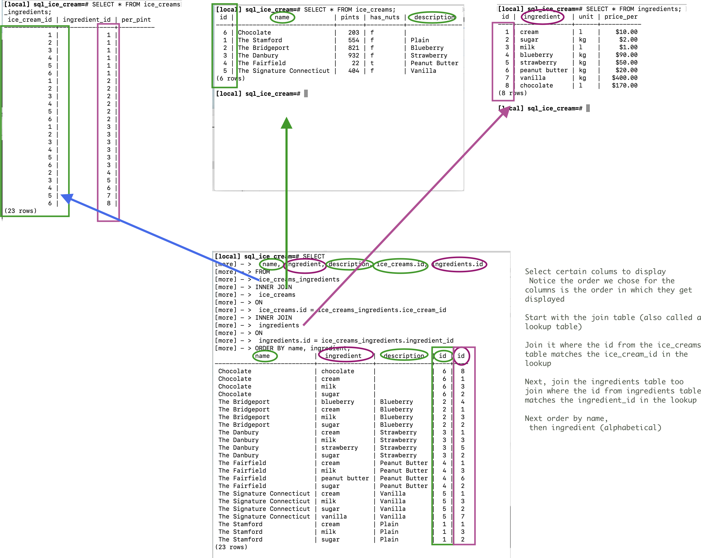

[](https://generalassemb.ly/education/web-development-immersive)


# PostGres - Cont

## Lesson Objectives

1. Many to Many
1. Joins

## Data Modeling



One ice cream has many ingredients. Ingredients can be in many ice creams.

Because this relationship is many to many, we can't just add a foreign key to one of our tables.

We'll need to make a `join` table (or a look up table). This is going to match up our ice cream and ingredients.We can add additional information to this table too:


For example each pint of ice cream will take different amounts of cream, milk and sugar to make room for other ingredients.

This can get really complicated. It's good to draw out an Entity Relation Diagram (ERD) [More info here](https://www.smartdraw.com/entity-relationship-diagram/)

First, our ingredients table:

```sql
CREATE TABLE ingredients(id SERIAL PRIMARY KEY, ingredient VARCHAR(64), unit VARCHAR(64), price_per MONEY );

INSERT INTO ingredients (ingredient, unit, price_per) VALUES
('cream', 'l' , 10),
('sugar' , 'kg', 2),
('milk', 'l', 1),
('blueberry', 'kg', 90),
('strawberry', 'kg', 50),
('peanut butter', 'kg' , 20),
('vanilla', 'kg', 400),
('chocolate', 'l', 170);


SELECT * FROM ingredients;
```

Now our join table:


```sql
CREATE TABLE ice_creams_ingredients (ice_cream_id INT, ingredient_id INT, per_pint DECIMAL);

INSERT INTO ice_creams_ingredients (ice_cream_id, ingredient_id) VALUES
(1, 1),
(2, 1),
(3, 1),
(4, 1),
(5, 1),
(6, 1),
(1, 2),
(2, 2),
(3, 2),
(4, 2),
(5, 2),
(6, 2),
(1, 3),
(2, 3),
(3, 3),
(4, 3),
(5, 3),
(6, 3),
(2 , 4),
(3 , 5),
(4, 6),
(5, 7),
(6, 8);
```

Let's do a query to see if the right ingredients are in the right ice creams!

```sql
SELECT
  name, ingredient, description, ice_creams.id, ingredients.id
FROM
 ice_creams_ingredients
INNER JOIN
 ice_creams  
ON
 ice_creams.id = ice_creams_ingredients.ice_cream_id
INNER JOIN
 ingredients
ON
 ingredients.id = ice_creams_ingredients.ingredient_id
ORDER BY name, ingredient;
```

## BONUS FIGURE IT OUT

Show the cities where strawberries need to be shipped


<hr>

### Hungry For More
- [Advanced SQL](5.ADVANCED_SQL.md)

### License

1. All content is licensed under a CC­BY­NC­SA 4.0 license.
1. All software code is licensed under GNU GPLv3. For commercial use or
    alternative licensing, please contact legal@ga.co.
