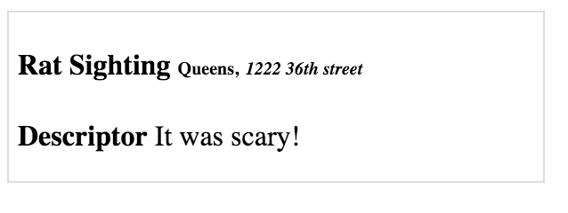

# Rat-to-Restaurant

#### Origins: NYC Campus ~ Spring 2016

 The new Tourist of NYC Department has commissioned you to find the out how well restaurants in NYC are dealing with the ever-powerful, ever-clever rat population.

 New York City has a web site with open data. [NYC Open Data](https://opendata.cityofnewyork.us/)

 You can search for all sorts of things there and there is a lot of great data that can be put to great use!

 We'll be using restaurant violations and rat sightings data.

## Dependencies (recommended NPM Packages)
- Express
- JSX
- Request (make requests to other web sites in order to get data back)
- Morgan (more informative info on request/responses logging in terminal)

## Data

Both sets of data will be in JSON format:

(large data sets, will take a while to load)

- [Rat Signtings](https://data.cityofnewyork.us/resource/3q43-55fe.json)

- [Restaurant Violations](https://data.cityofnewyork.us/resource/9w7m-hzhe.json)

### Step 0
- Build an express app with the above dependencies

### Step 1
 Build two routes, `/rats` and `/violations`. Each will render a separate view that has a form. That form will allow the user to search each dataset by zipcode. (You'll have to look at the data for the key, it might be under `zip`, `zipcode`, `incident_zip` etc.)

 The pure JSON response from the NYC Open Data API will be returned in another route called `/rats/results` or `/violations/results`

 There are a lot of extra data, the user simply doesn't need to see all of it and we're mostly interested in the description and location information.

 #### 1a (Bonus, don't need to complete this step to keep going, you will be 'filtering' via what you choose to display with JSX in the next step):

 Filter out the unnecessary key-value pairs and only return the following:

     Rats: boro, location, incident zip, lat, long, descriptor

     Violations: boro, dba, zip code, grade, street, action, violation_description

 (If you want to include other data go right ahead)

 At this point we are just rendering json!

 #### 1b:
 Make these views:

 `rat_sighting_results.JSX`
 `violation_results.JSX`

 Now that we have the right data for each request let's style it and make it more user friendly.

 We're going to use the concept of cards. Each rat sighting or restaurant violation will have it's own card.

 A card is simply a div that styles and displays the information in a sane and readable way. You can style the card however you like, but for example a bare bones rat sightings card might look like this:

 

 You can read about cards here:
 https://econsultancy.com/blog/64646-15-delicious-examples-of-card-based-web-design/

 ### [CHECK IN] What should we have now!?

 We should now have a web application that has two initial views at `/rats` and `/violations` that each display a form that allows us to search for all rat sightings or all restaurant violations by zip code.

 When the user clicks the button attached to the form it should direct the user to a new view (our results views) and new route that displays that parsed data using the `card` design pattern.

 But our cards are all stacked on top of each other!?

 

 #### 1c

 If you surround all of your card results in a div with a class of container.

 Add this css

 	.container {
 	    display: flex;
     	flex-wrap: wrap;
 	}

 What is [flexbox!?](https://css-tricks.com/snippets/css/a-guide-to-flexbox/) It's super cool!

 >[Flexbox provides] a more efficient way to lay out, align and distribute space among items in a container, even when their size is unknown and/or dynamic (thus the word "flex"). The main idea behind the flex layout is to give the container the ability to alter its items' width/height (and order) to best fill the available space (mostly to accommodate to all kind of display devices and screen sizes). A flex container expands items to fill available free space, or shrinks them to prevent overflow."

 Those two css properites will now display our cards dynamically so they stretch across the screen inline and will wrap depending on the width of the screen!

 

 ## Step 2 Restaurants

 Build a separate route `/restaurants` which will be used to display all relevant information for restaurants. It should be a form, which allows you to search for a zip code. It should take you to `/restaurants/results` which will display information about all restaurant in that respective zip code.

 #### 2a

 First start with the violations data you already have / know how to retrieve. There are many `violations` for each restaurant. Combine them in a `restaurants` data structure which is an array of `restaurant` objects. Each `restaurant` object should have at minimum the following properties:

 - `name`
 - `street`
 - `violations`

 The violations property should be an array of the violation object you built previously, which pertain to the particular restaurant. Render your `restaurants` array as pure JSON in the browser.

 

 #### 2b

 Now that you have your array of `restaurants`, fetch all the rat sightings for the same zipcode. Add a new property to each `restaurant` object named `rats` and set it to `0` by default. For each rat sighting on the **same street** as a restaurant increment that restaurants `rats` property by one.

 ---

 *At this point you should be able to make a get request `/restaurants`, search for a zip code and see JSON data in the browser which is an array of `restaurants` each of which have `name`, `street`, `violations` and `rats` as properties*

 ---

 #### 2c

 Create a view `restaurants.JSX` which displays cards for each restaurant, which matches your query. Keep in mind that each restaurant has violations, each of which is its own card. CARDCEPTION!

 

 ### Step 3

 A great metric for the cleanliness of a restaurant is the RAT-O-METER™, which is the ratio of nearby rats to the number of violations. A high RAT-O-METER indicates that a restaurant manages to keep an acceptable level of cleanliness relative to the number of rats around. Sort your results based on their RAT-O-METER rating!

 ## Bonus

 Finished Everything?! Congratulations! You just built something society can benefit from! Make it pretty and go talk to some investors. This can be the next Yelp!
