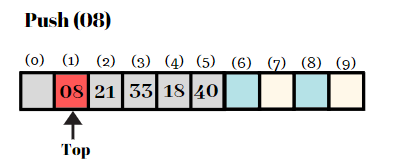

## Data structures with Ruby - Stack (array based)
A stack is an example of a linear data structure. Linear data structures are collections of components arranged in a straight line. When we add or remove components of linear data structures, they grow and shrink. If we restrict the growth of a linear data structure so that new components can only be added or removed only at one end, we have a stack.
A pile of books, a stack of dinner plates, a box of pringles potato chips can all be thought of examples of stacks. The basic operating principle is that last item you put in is first item you can take out. That is, that a stack is a Last In First Out (LIFO) structure.

Regardless of which language a stack is implemented in, there are a couple functions that will almost always be needed:
- push: the function that’s used to add elements into the stack
-  pop: the function that’s used to remove elements from the stack
-  top (peek): a function that returns the first value (what’s on top of the stack), but doesn’t remove it
-  isEmpty: a function that checks if the stack is empty or not — super helpful when trying to clear all the elements from a stack
-  size: a function that returns the number of elements that are in a stack at any given time

<p align="center">

</p>

We are given a stack of elements: 12 , 08 , 21 , 33 , 18 , 40.

### Step 1:
- Push (40)
- Top = 40
- Element is inserted at a[5].
<p align="center">

</p>

### Step 2:
- Push (18)
- Top = 18
- Element is inserted at a[4].
<p align="center">

</p>

### Step 3:
- Push (33)
- Top = 33
- Element is inserted at a[3]
<p align="center">

</p>

### Step 4:
- Push (21)
- Top = 21
- Element is inserted at a[2]
<p align="center">

</p>

### Step 5:
- Push (08)
- Top = 08
- Element is inserted at a[1]
<p align="center">

</p>

### Step 6
- Push (12)
- Top = 12
- Element is inserted at a[0]
<p align="center">

</p>

### Step 7:
- Top = -1
- End of array
<p align="center">

</p>


```ruby
class Stack
  def initialize(size)
    @size = size
    @store = Array.new(@size)
    @top = -1
  end

  def pop
    if empty?
      nil
    else
      popped = @store[@top]
      @store[@top] = nil
      @top = @top.pred
      popped
    end
  end

  def push(element)
    if full? or element.nil?
      nil
    else
      @top = @top.succ
      @store[@top] = element
      self
    end
  end

  def display
    @store.each { |item|
      p item
    }
  end

  def size
    @size
  end

  def look
    @store[@top]
  end

  private

  def full?
    @top == (@size - 1)
  end

  def empty?
    @top == -1
  end
end

myStack = Stack.new(6)

print "size of myStack is ", myStack.size, "\n"

myStack.push(12)
myStack.push(8)
myStack.push(21)
myStack.push(33)
myStack.push(18)
myStack.push(40)

myStack.display

print "removing elements\n"

myStack.pop
myStack.pop

myStack.display
```
Our output

```
size of myStack is 6
12
8
21
33
18
40
removing elements
12
8
21
33
nil
nil
```

## Mr.Big 0
The stack is using an array as the underlying storage. The methods push, pop and peek are performing a single indexed access to the underlying array. 
As arrays have O(1) access to elements, the methods push, pop and peek also have O(1) complexity.

This means you have a very efficient stack. But the obvious problem is the size is limited to maxSize. When the stack grows larger than this, it will just crash. So in practice you need to be able to grow the array, which will make the algorithm more interesting.

## Applications of Stack
### Expression Evaluation
- Stack is used to evaluate prefix, postfix and infix expressions
### Expression Conversion
- An expression can be represented in prefix, postfix or infix notation. Stack can be used to convert one form of expression to another
### Syntax Parsing
- Many compilers use a stack for parsing the syntax of expressions, program blocks etc. before translating into low level code
### Backtracking
- Suppose we are finding a path for solving maze problem. We choose a path and after following it we realize that it is wrong. Now we need to go back to the beginning of the path to start with new path. This can be done with the help of stack.
### Parenthesis Checking
- Stack is used to check the proper opening and closing of parenthesis
### String Reversal
- Stack is used to reverse a string. We push the characters of string one by one into stack and then pop character from stack
### Function Call
- Stack is used to keep information about the active functions or subroutines

### Question :cat:

Steve has a string of lowercase characters in range ascii[‘a’..’z’]. He wants to reduce the string to its shortest 
length by doing a series of operations. In each operation he selects a pair of adjacent lowercase letters that match, and he deletes them. For instance, the string aab could be shortened to b in one operation.

Steve’s task is to delete as many characters as possible using this method and print the resulting string. If the final string is empty, print "Empty String" without quotes.

characters can be deleted only if they form a pair and are same(i.e from aaa we can only delete 2 a's and will be left with a single a).

INPUT:

A single string, s.

CONSTRAINTS:

1<=|s|<=1000

OUTPUT:

If the final string is empty, print Empty String; otherwise, print the final non-reducible string.

For an example: 

aaabccddd => abd

Steve performs the following sequence of operations to get the final string:

aaabccddd ? abccddd ? abddd ? abd

<p>

</p>
